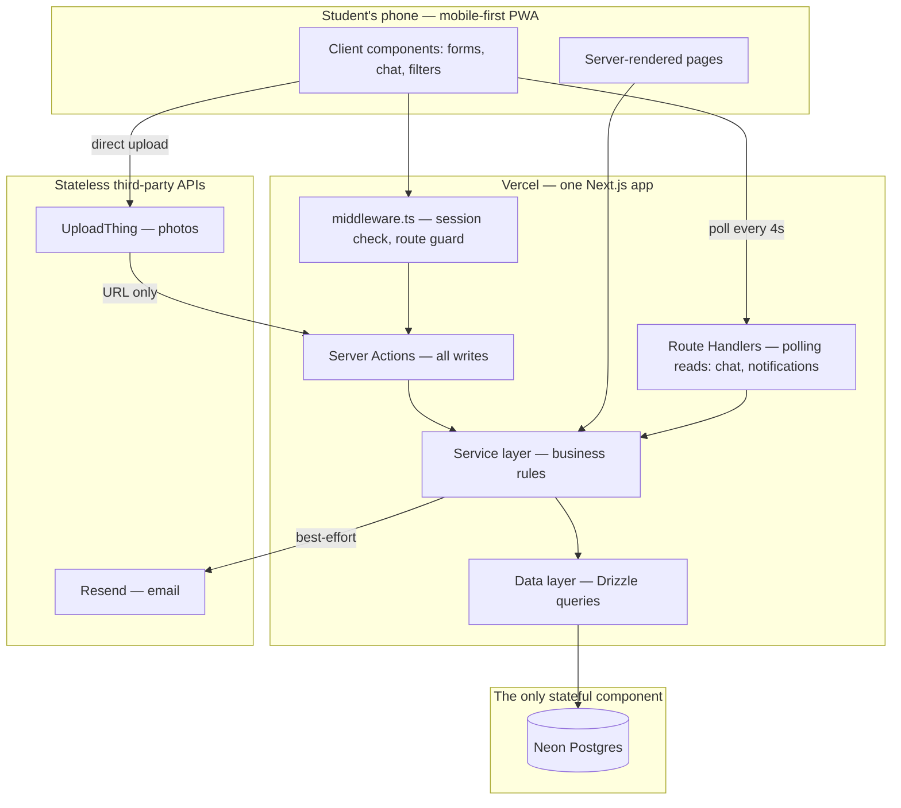
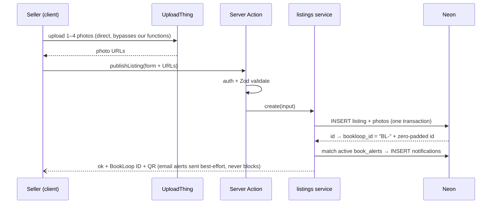
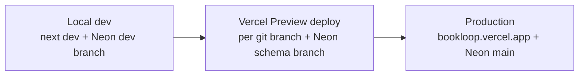

# BookLoop — Application Architecture

**Deployment target:** Vercel (only) + Neon Postgres (only database/infrastructure)
**Goal:** an architecture simple enough to build fast, but structured so the **trial launch runs properly** and nothing needs a rewrite to scale to more schools.
**Last updated:** 13 Sep 2026

Related docs: `TECH.md` (stack) · `DATABASE_SCHEMA.md` (tables) · `SCREEN_FLOW.md` (screens) · `WORKFLOW.md` (UX flows this must serve) · `UI_REFERENCE.md` (design system) · `docs/phases/` (build order) · `DECISIONS.md` (D-033–D-040 are the architecture decisions from this doc)

---

## 1. Architecture style: a modular monolith

**One Next.js app is the entire system.** No microservices, no separate API server, no queue, no Redis, no cron infrastructure. Everything that must survive a restart lives in Neon Postgres; everything else is a stateless Vercel function.

Why this is the *best* architecture here (deep-analysis version, not just "it's easy"):

1. **Vercel functions are stateless and short-lived.** Any design that needs in-memory state (WebSocket servers, in-process queues, session caches) fights the platform. The winning move is to make Postgres the *only* stateful component — then the app can scale to any number of function instances with zero coordination.
2. **The pilot's real risk is not load — it's bugs and slow iteration.** ~500 students producing at most a few requests/second at peak is trivial traffic. Microservices would multiply deploy targets, failure modes and debugging surface for zero benefit.
3. **Scaling later is a swap-per-seam problem.** The monolith is *modular*: internal layers (below) have clean seams, so each future upgrade (queue, real-time, search engine) replaces one seam without touching the rest.



---

## 2. Internal layers (the seams that matter)

Strict one-direction dependency: **UI → Actions/Handlers → Services → Repositories → DB.** Nothing skips a layer downward; nothing imports upward.

| Layer | Location | Responsibility | Must NOT do |
|---|---|---|---|
| **UI** | `src/app/**`, `src/components/**` | Rendering, forms (react-hook-form + Zod client-side) | Query the DB, contain business rules |
| **Actions / Handlers** | `src/app/**/actions.ts`, `src/app/api/**` | Auth check → Zod parse → call one service → `revalidatePath` | Contain logic beyond validation & dispatch |
| **Services** | `src/services/*.ts` | ALL business rules: status transitions, ownership checks, alert matching, BookLoop ID generation | Know about HTTP, forms, or React |
| **Repositories** | `src/db/repos/*.ts` | Drizzle queries only | Make business decisions |

Why the discipline pays off at *this* size: the service layer is the unit-testable core (no HTTP mocking needed), and it's the seam where every post-pilot upgrade lands — e.g., "publish listing" today calls `alerts.match()` inline; later it enqueues a job. One line changes; UI and repos don't.

**Folder structure:**

```
src/
├── app/
│   ├── (auth)/           # signup, login, confirm-email
│   ├── (main)/           # home, browse, listing/[id], sell, exchange, donate, profile
│   ├── chats/[id]/
│   └── api/
│       ├── chats/[id]/messages/   # GET — polling endpoint
│       ├── notifications/          # GET — badge count polling
│       └── uploadthing/            # UploadThing callback
├── components/           # shadcn/ui + app components
├── services/             # listings.ts, chat.ts, transactions.ts, alerts.ts, users.ts
├── db/
│   ├── schema.ts         # from DATABASE_SCHEMA.md
│   ├── client.ts         # Neon serverless driver + Drizzle instance
│   └── repos/
├── lib/                  # auth.ts (Better Auth), zod-schemas.ts, qr.ts, constants.ts
└── middleware.ts
```

---

## 3. Data-flow design (the four flows that carry the app)

### 3.1 Reads — React Server Components, cache-tagged
Browse/search, listing detail, and profile pages are **server components** calling services directly — no client-side data fetching, no API round-trip, fast on cheap phones. Every write ends with `revalidatePath`/`revalidateTag`, so pages are cached until the underlying data actually changes.

### 3.2 Writes — Server Actions with a fixed pipeline
Every mutation follows the same five steps, no exceptions:

> **session check → Zod parse (server-side, same schema as the client) → service call → revalidate → typed result `{ ok } | { error }`**

Server actions never throw raw errors to the client; users see friendly messages, details go to logs.

### 3.3 Publishing a listing (the busiest write)



Two deliberate choices: photos go **client → UploadThing directly** (a 4MB phone photo never passes through a Vercel function, avoiding body-size limits and slow requests), and **alert matching runs synchronously** in the same action — at one-school scale it's a single indexed query over a few hundred alert rows (~milliseconds). The queue upgrade slot exists but is not needed for the trial.

### 3.4 Chat — polling designed to be cheap
The trial's highest-frequency traffic is chat polling, so it's engineered, not naive:

- `GET /api/chats/[id]/messages?after=<lastMessageId>` returns **only new rows** (incremental, hits the `(chat_id, created_at)` index).
- Client polls **every 4s only while the chat screen is visible** (Page Visibility API); backs off to 15s after ~2 min of inactivity; stops entirely in background tabs.
- Unread badge = one cheap `GET /api/notifications` count poll every 30s on the app shell.

Worst-case math: 50 simultaneously open chats = ~12.5 req/s of single-indexed-query reads — far below both Vercel and Neon free-tier ceilings. See §6.

### 3.5 The listing state machine (trust flow)
`listings.status` transitions are **guarded in the transactions service** — the only place allowed to change status:

```
active ──(seller marks in chat)──► reserved ──(buyer confirms)──► closed
   ▲            │                                      │
   └────────────┘ (either side cancels)                └─► ratings prompt (both sides)
```

Guards enforced server-side: only the seller can mark; only the chat's buyer can confirm; `transactions.listing_id` is UNIQUE so a listing can only close once — the invariant holds even if two requests race.

---

## 4. Cross-cutting concerns

### Auth & authorization
- **Better Auth** with the Drizzle adapter — sessions, password hashes and email-verification tokens live in Neon (still "Vercel + Neon only").
- `middleware.ts` redirects unauthenticated users; unconfirmed-email users can browse but not list or chat (checked in services, not just UI).
- **Authorization lives in services**, never in UI: every mutation re-checks ownership (only the seller edits a listing, only chat participants read its messages). UI hiding a button is convenience, not security.

### Database connection strategy
Serverless functions can't hold classic connection pools. Use the **Neon serverless driver** (`@neondatabase/serverless`) over HTTP with `drizzle-orm/neon-http` — each query is a stateless HTTP call, so **connection exhaustion is structurally impossible** no matter how many function instances Vercel spins up. Multi-statement operations (listing + photos) use explicit transactions.

### Validation — one schema, two gates
Every Zod schema lives in `src/lib/zod-schemas.ts` and runs **twice**: client-side (instant form feedback) and server-side (the actual gate). Category-conditional rules are encoded once (`textbook` requires class+subject, `competitive` requires exam, `sell` requires price, `exchange` requires wants_book) — the DB's nullable columns are backed by real validation.

### Abuse & rate limiting (no Redis, by constraint)
- Hard caps enforced in services with plain DB counts: max **20 active listings** per user, max **10 new chats/day**, max **1 message/second** per user (reject if a message from the same sender exists < 1s old — uses the existing index).
- UploadThing config: max 4 files, 4MB each, images only.
- Vercel's platform-level DDoS protection covers the network layer. Upstash rate limiting is the named upgrade slot — not needed for one school.

### Error handling & observability (trial-launch requirement)
- Services throw typed domain errors (`NotOwnerError`, `ListingClosedError`); actions map them to friendly messages.
- `console.error` with structured context (userId, listingId, action) → searchable in **Vercel Logs**.
- Global `error.tsx` + `not-found.tsx` so students never see a stack trace.
- Health check: `GET /api/health` runs `SELECT 1` — verifies app + DB in one URL, usable with any free uptime pinger.
- Sentry (free tier) is an optional week-one add if silent client-side errors become a problem; not required infra.

### Failure modes — what breaks what
| If this fails | Effect | Designed behavior |
|---|---|---|
| **Neon** | Everything | Only true single point of failure — acceptable and unavoidable in a DB-backed app. Neon free tier includes point-in-time restore; health check catches it in minutes. |
| **Resend** | Emails | **Best-effort by design**: signup still works (confirm later), alert emails silently skip — the in-app `notifications` row is the source of truth, email is a bonus. |
| **UploadThing** | New photo uploads | Existing listings unaffected (URLs already stored). Listing form shows upload error; user retries. |
| **A deploy breaks prod** | App | Vercel instant rollback to the previous deployment (one click). |

---

## 5. Environments & the path to trial launch



- **Neon branching = free staging.** Each risky change gets a Neon branch (instant copy-on-write of real data) wired to a Vercel preview deploy. Test the migration there, then `drizzle-kit push` to main. Prod data is never the test bed.
- **Seed script** (`src/db/seed.ts`): generates realistic users/listings/chats for dev and demo — also how the book-drive listings get bulk-loaded before launch day.
- **Trial-launch checklist:** seed drive listings → health check green → uptime pinger armed → walkthrough of the full lifecycle (list → alert → chat → reserve → close → rate) on a preview branch → announce.

---

## 6. Capacity check — proving the trial "handles it"

Assumptions: 1 school, ~500 students, ~40% weekly active, peak = result-day/term-end evening with ~50 concurrent users.

| Resource | Free-tier ceiling | Trial peak (est.) | Headroom |
|---|---|---|---|
| Vercel function invocations | ~1M/mo | Chat+badge polling dominates: ~0.5–1.5M/mo worst case | Tight only if chat polling is naive — visibility-gating + backoff (§3.4) keeps it in range; first paid dollar goes here if ever |
| Vercel bandwidth | 100GB/mo | Pages are light; photos served by UploadThing, not Vercel | Large |
| Neon compute | Autoscaling free tier, scale-to-zero | Single-indexed-query workload, ~15 req/s peak | Large |
| Neon storage | 0.5GB | Text-only rows (photos external): tens of MB | Very large |
| Resend | 100 emails/day | Confirmations + alert digests | Fine; batch alerts into digests if exceeded |
| UploadThing | 2GB | ~1,000 photos @ ~1.5MB | Monitor; Cloudinary compression is the upgrade slot |

**Conclusion:** the only genuinely scarce resource is Vercel invocations, and the chat-polling design in §3.4 exists specifically because of it. Everything else has an order of magnitude of headroom.

---

## 7. Scale-out map (after the trial)

Each seam upgrades independently — no rewrite, because the seam was drawn in advance:

| Seam (today) | Trigger | Upgrade |
|---|---|---|
| Chat polling (§3.4) | Multi-school, polling cost dominates | Pusher/Ably behind the same chat service interface |
| Synchronous alert matching (§3.3) | Publish action feels slow | Inngest / Vercel Cron + a `jobs` table in Neon |
| `ILIKE` search | Search feels dumb at 10k+ listings | Postgres full-text (free, same DB) → Meilisearch |
| DB-count rate limits | Real abuse appears | Upstash Redis rate limiting in middleware |
| Single school in one DB | Multi-school launch | `school_id` column + row scoping (schema change is additive) |
| PWA | Retention demands push notifications | React Native/Expo app on the same server actions/API |

---

## 8. Architecture rules (enforced during development)

1. Postgres is the **only** stateful component; functions never hold state between requests.
2. No layer-skipping: UI never touches Drizzle; repos never make business decisions.
3. Every mutation runs the five-step server-action pipeline (§3.2) — no exceptions.
4. Every status change goes through the transactions service (§3.5) — no direct `UPDATE listings SET status`.
5. Photos never pass through our functions — client → UploadThing directly.
6. Email is always best-effort; the in-app notification row is the source of truth.
7. New architecture decisions get a `DECISIONS.md` entry when made.
