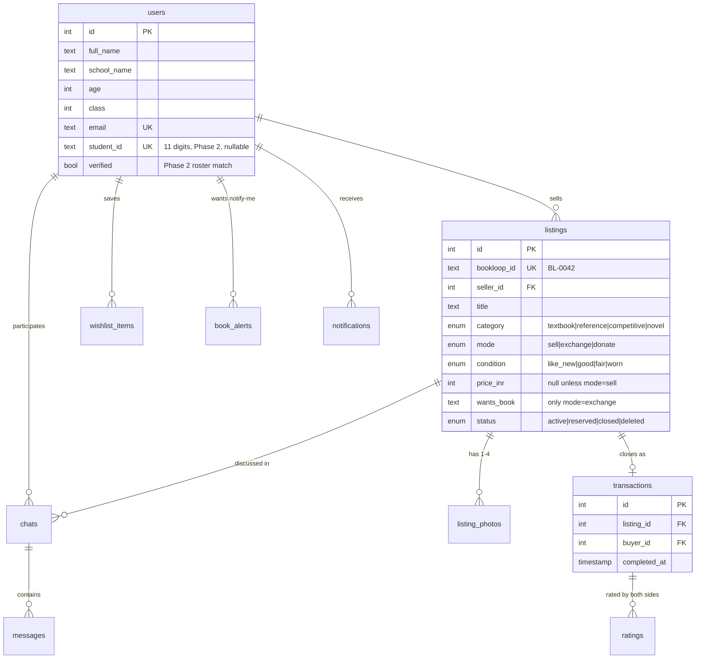

# BookLoop — Database Schema

**Database:** Neon Postgres · **ORM:** Drizzle
**Last updated:** 13 Sep 2026

Design rules used throughout:
- Photos are **URLs only** (files live in UploadThing).
- Phase 2 verification columns (`student_id`, `verified`) exist from day one but stay `NULL`/`false` in the prototype — no migration needed at full launch.
- One `listings` table serves all four modes (Sell / Exchange / Donate) via a `mode` column — they share 90% of their fields and one search screen.
- Better Auth additionally creates its own `session`, `account` and `verification` tables automatically; they are not hand-defined here.

---

## 1. ER diagram



---

## 2. Drizzle schema (`src/db/schema.ts`)

```ts
import {
  pgTable, pgEnum, serial, integer, text, varchar,
  boolean, timestamp, uniqueIndex, index,
} from "drizzle-orm/pg-core";

// ---------- Enums ----------

export const categoryEnum = pgEnum("category", [
  "textbook",     // NCERT/board, class-wise
  "reference",    // guides, question banks, class-wise
  "competitive",  // JEE / NEET / Olympiad / other
  "novel",        // fiction, non-fiction, general reading
]);

export const modeEnum = pgEnum("mode", ["sell", "exchange", "donate"]);

export const conditionEnum = pgEnum("condition", [
  "like_new", "good", "fair", "worn",
]);

export const listingStatusEnum = pgEnum("listing_status", [
  "active",    // live and searchable
  "reserved",  // buyer agreed in chat, handover pending
  "closed",    // sold / exchanged / donated (see transactions)
  "deleted",   // removed by seller
]);

export const notificationTypeEnum = pgEnum("notification_type", [
  "alert_match",   // a book_alert matched a new listing
  "chat_message",  // unread message nudge
  "confirm_handover", // seller marked sold — buyer must confirm
]);

// ---------- Users ----------
// Better Auth owns password hashes + sessions in its own tables;
// this table holds the BookLoop profile (linked 1:1 by Better Auth's user id).

export const users = pgTable("users", {
  id: serial("id").primaryKey(),
  authId: text("auth_id").notNull().unique(),      // Better Auth user id
  fullName: text("full_name").notNull(),
  schoolName: text("school_name").notNull(),
  age: integer("age").notNull(),
  class: integer("class").notNull(),               // 1–12
  email: text("email").notNull().unique(),
  emailConfirmed: boolean("email_confirmed").notNull().default(false),

  // ---- Phase 2 (full launch) — stay empty in the prototype ----
  studentId: varchar("student_id", { length: 11 }).unique(), // 11-digit school ID
  verified: boolean("verified").notNull().default(false),    // roster match passed

  createdAt: timestamp("created_at").notNull().defaultNow(),
});

// ---------- Listings (all 4 modes) ----------

export const listings = pgTable(
  "listings",
  {
    id: serial("id").primaryKey(),
    bookloopId: varchar("bookloop_id", { length: 10 }).notNull().unique(), // "BL-0042"
    sellerId: integer("seller_id").notNull().references(() => users.id),

    title: text("title").notNull(),
    category: categoryEnum("category").notNull(),
    mode: modeEnum("mode").notNull(),

    // Category-dependent fields (nullable; enforced by Zod per category):
    class: integer("class"),        // textbook, reference
    subject: text("subject"),       // textbook, reference, competitive
    exam: text("exam"),             // competitive: JEE | NEET | Olympiad | other
    genre: text("genre"),           // novel
    author: text("author"),         // novel
    editionYear: varchar("edition_year", { length: 20 }), // syllabus changes matter

    condition: conditionEnum("condition").notNull(),
    conditionNote: text("condition_note"),

    priceInr: integer("price_inr"),   // required for sell; NULL for exchange/donate
    wantsBook: text("wants_book"),    // exchange only: "Class 8 Maths"

    status: listingStatusEnum("status").notNull().default("active"),
    createdAt: timestamp("created_at").notNull().defaultNow(),
    updatedAt: timestamp("updated_at").notNull().defaultNow(),
  },
  (t) => [
    // The browse/filter screen hits these constantly:
    index("listings_search_idx").on(t.status, t.category, t.class, t.subject),
    index("listings_seller_idx").on(t.sellerId),
  ],
);

export const listingPhotos = pgTable("listing_photos", {
  id: serial("id").primaryKey(),
  listingId: integer("listing_id").notNull()
    .references(() => listings.id, { onDelete: "cascade" }),
  url: text("url").notNull(),          // UploadThing URL
  sortOrder: integer("sort_order").notNull().default(1), // 1–4
});

// ---------- Chat ----------
// One chat per (listing, buyer) pair. No phone/email ever stored in messages by design.

export const chats = pgTable(
  "chats",
  {
    id: serial("id").primaryKey(),
    listingId: integer("listing_id").notNull().references(() => listings.id),
    buyerId: integer("buyer_id").notNull().references(() => users.id),
    createdAt: timestamp("created_at").notNull().defaultNow(),
  },
  (t) => [uniqueIndex("chats_listing_buyer_uq").on(t.listingId, t.buyerId)],
);

export const messages = pgTable(
  "messages",
  {
    id: serial("id").primaryKey(),
    chatId: integer("chat_id").notNull()
      .references(() => chats.id, { onDelete: "cascade" }),
    senderId: integer("sender_id").notNull().references(() => users.id),
    body: text("body").notNull(),
    createdAt: timestamp("created_at").notNull().defaultNow(),
  },
  // Polling query: "messages in this chat newer than X" — needs this index.
  (t) => [index("messages_chat_time_idx").on(t.chatId, t.createdAt)],
);

// ---------- Transactions & ratings ----------
// Created when the seller taps "Mark as Sold/Exchanged/Donated" in chat;
// completed when the buyer confirms. Listing flips to status=closed.

export const transactions = pgTable("transactions", {
  id: serial("id").primaryKey(),
  listingId: integer("listing_id").notNull().unique() // one closure per listing
    .references(() => listings.id),
  sellerId: integer("seller_id").notNull().references(() => users.id),
  buyerId: integer("buyer_id").notNull().references(() => users.id),
  mode: modeEnum("mode").notNull(),
  priceInr: integer("price_inr"),                 // NULL for exchange/donate
  sellerMarkedAt: timestamp("seller_marked_at").notNull().defaultNow(),
  buyerConfirmedAt: timestamp("buyer_confirmed_at"), // NULL until buyer confirms
});

export const ratings = pgTable(
  "ratings",
  {
    id: serial("id").primaryKey(),
    transactionId: integer("transaction_id").notNull()
      .references(() => transactions.id),
    raterId: integer("rater_id").notNull().references(() => users.id),
    rateeId: integer("ratee_id").notNull().references(() => users.id),
    thumbsUp: boolean("thumbs_up").notNull(), // true = 👍, false = 👎
  },
  // Each side rates once per transaction:
  (t) => [uniqueIndex("ratings_tx_rater_uq").on(t.transactionId, t.raterId)],
);

// ---------- Wishlist & notify-me alerts ----------
// Two different features: saving a live listing vs. "tell me when X appears".

export const wishlistItems = pgTable(
  "wishlist_items",
  {
    id: serial("id").primaryKey(),
    userId: integer("user_id").notNull().references(() => users.id),
    listingId: integer("listing_id").notNull().references(() => listings.id),
    createdAt: timestamp("created_at").notNull().defaultNow(),
  },
  (t) => [uniqueIndex("wishlist_user_listing_uq").on(t.userId, t.listingId)],
);

export const bookAlerts = pgTable("book_alerts", {
  id: serial("id").primaryKey(),
  userId: integer("user_id").notNull().references(() => users.id),
  // Any combination of criteria; new listings are matched against these:
  keyword: text("keyword"),          // matched against listing title
  category: categoryEnum("category"),
  class: integer("class"),
  subject: text("subject"),
  active: boolean("active").notNull().default(true),
  createdAt: timestamp("created_at").notNull().defaultNow(),
});

// ---------- In-app notifications ----------
// Prototype has no push notifications — this table feeds an in-app list.

export const notifications = pgTable(
  "notifications",
  {
    id: serial("id").primaryKey(),
    userId: integer("user_id").notNull().references(() => users.id),
    type: notificationTypeEnum("type").notNull(),
    text: text("text").notNull(),
    listingId: integer("listing_id").references(() => listings.id),
    readAt: timestamp("read_at"),    // NULL = unread
    createdAt: timestamp("created_at").notNull().defaultNow(),
  },
  (t) => [index("notifications_user_idx").on(t.userId, t.readAt)],
);
```

---

## 3. Lifecycle walkthroughs (how the tables work together)

**A book gets sold:**
1. Seller submits the listing form → row in `listings` (status `active`) + 1–4 rows in `listing_photos`. `bookloop_id` is generated (`BL-` + zero-padded `id`).
2. New listing is matched against `book_alerts` → matching users get a `notifications` row (+ Resend email).
3. Buyer opens chat → row in `chats`, messages accumulate in `messages` (chat screen polls this table).
4. They agree → seller taps **Reserve for this buyer** → `transactions` row created (`seller_marked_at` = now), listing `status = reserved`. Handover at the school pickup point.
5. Seller taps **Mark as Sold** → buyer confirms → `buyer_confirmed_at` set, listing `status = closed`.
   *Zombie guard (D-043):* a reservation with `buyer_confirmed_at` still NULL 72h after `seller_marked_at` is lazily reverted on next read — listing back to `active`, transaction voided, both parties notified. No cron needed.
6. Both sides get a one-tap 👍/👎 prompt → rows in `ratings`. A profile's 👍 count = `count(ratings where ratee_id = user AND thumbs_up)`.

**Exchange:** same flow with `mode = exchange`, `price_inr = NULL`, `wants_book` filled. "Possible matches for you" (stretch goal) = listings where `wants_book` roughly matches something you have listed — no schema change needed.

**Donation:** `mode = donate`, `price_inr = NULL`. "Claimed" in the UI = status `reserved`.

**Phase 2 verification (no migration needed):** student submits their 11-digit ID + name → checked against the school roster → on match, set `users.student_id` and `users.verified = true`. The unique constraint on `student_id` enforces one account per ID.

---

## 4. Commands

```bash
npx drizzle-kit push     # sync schema to Neon (prototype workflow)
npx drizzle-kit studio   # browse data visually
```
