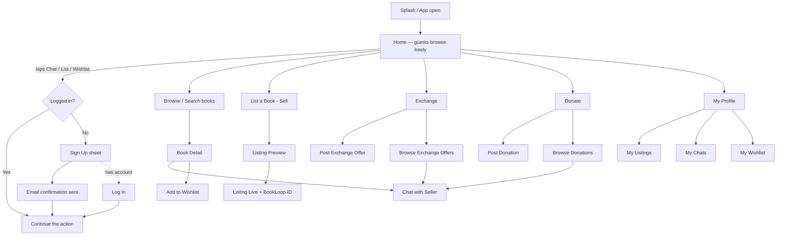

# BookLoop — Prototype Screen Flow

**Phase:** Prototype (single school, unverified accounts)
**Signup data:** Name, School, Age, Class, Email (confirmation link), Password — no Student ID at this phase
**Last updated:** 13 Sep 2026

---

## 1. Flow overview

---

## 2. Screens in detail

### S2 — Welcome *(removed — see D-041)*
- No welcome wall: the app opens straight into Home with guest browsing (Amazon pattern — the shelves are the landing page).
- Sign Up / Log In live in the Profile tab and in the intent-triggered sheet (S3), which appears when a guest taps **Chat**, **List**, or **Wishlist** and returns them to where they were.
- Tagline + "For students of [School Name]" trust copy moves to the Home header for guests.

### S3 — Sign Up (slide-up sheet)
| Field | Rules |
|---|---|
| Full name | required |
| School name | required |
| Age | required |
| Class | dropdown (1–12) |
| Email | required, confirmation link sent |
| Password | min 8 chars |

- Login uses **Email + Password**.
- On submit → "Check your email" screen (S3a). Account works immediately; unconfirmed accounts can browse but not list or chat.
- **Later (full launch):** student enters their 11-digit Student ID + name, matched against the school-provided roster → `verified` flag → "Verified student" badge appears on profile and listings. One account per Student ID.

### H — Home *(shelf anatomy per D-049 / UI_REFERENCE.md §7)*
- Search pill (always on top; full-round, expands to B1)
- **Mode tabs** under the search: **All · Buy · Exchange · Free** — one tap re-scopes every shelf
- Horizontal shelves, each heading linking to pre-filtered results + "See all" at the end:
  - "Books for Class N" (profile-aware; generic newest for guests)
  - "Recently listed"
  - "Free — donations available"
  - "Wanted for exchange"
- Cards: max 5 elements — photo, one badge (condition / FREE), title, class·subject line, price
- Bottom nav: Home · Search · Sell (+) · Chats · Profile
- *(Selling stays one tap away via the ＋ tab — the old 4-action-card block is replaced by tabs + shelves)*

### B1 — Browse / Search
- Search by title text
- **Filter panel:**
  - Category: Textbook · Reference/Guide · Competitive exam · Novel/Other
  - Class (1–12) — shown for Textbook/Reference
  - Subject — shown for Textbook/Reference/Competitive
  - Exam (JEE/NEET/Olympiad/Other) — shown for Competitive
  - Condition: Like New · Good · Fair · Worn
  - Price: range slider + "Free (donations)" toggle
  - Mode: Buy · Exchange · Free (chips, mirror the Home tabs)
- Filters render as **removable chips** above results — active chip = green underline via border-color swap, no layout shift (UI_REFERENCE.md §6.5); filter state lives in the URL (shareable)
- Result cards: photo, title, class/subject chip, condition tag, price, seller name
- Empty state: "No match — add to wishlist and we'll notify you" → W1

### B2 — Book Detail
- Photo carousel (1–4 photos)
- Title, category, class, subject, edition/year
- Condition tier + seller's condition note
- Price (or **FREE** badge for donations, **EXCHANGE** badge with "wants: ___")
- BookLoop ID (short code, e.g. `BL-0042`) + QR code
- Seller card: name, class, 👍 count, listings count *(no phone/email shown — chat only)*
- **Sticky bottom bar: Chat with Seller** — solid primary green, the only green on the page, never scrolls away (UI_REFERENCE.md §3); wishlist heart overlays the photo (layered white-outline pattern, §6.4)

### L1 — List a Book (Sell)
Single form, one screen:
1. Photos (1–4, camera or gallery) — at least 1 required
2. Title
3. Category → conditional fields (class/subject/exam/genre as in B1 filters)
4. Edition / year (important: syllabus changes)
5. Condition tier (4 fixed options with example descriptions)
6. Condition note (optional free text)
7. Price — or toggle: **Sell / Exchange / Donate** (Exchange asks "what book do you want?", Donate hides price)

→ **L2 Preview** (exactly how buyers will see it) → **Publish**
→ **L3 Success**: "Live! Your BookLoop ID is BL-0042" + shareable QR

### E1 — Exchange
Two tabs:
- **Offers** (E3): list of exchange listings — card shows "HAS: Class 8 Science ⇄ WANTS: Class 8 Maths" → tap → B2-style detail → Chat
- **Post an offer** (E2): same as L1 with mode=Exchange
- **"For you" shelf** at the top of the tab: offers whose WANTS matches a book you have listed — one text-match query, no engine (built in Phase 5 Task 5.2; real matching engine + multi-way chains stay post-pilot, D-031).

### D1 — Donate
Two tabs:
- **Available donations** (D3): free books list → detail → Chat to claim
- **Donate a book** (D2): L1 form with mode=Donate
- Claimed books show "Claimed" and drop out of search

### C1 — Chat
- In-app text chat only; **no phone numbers or emails exposed**
- **Status stepper** at the top, identical for both sides: Chatting → Reserved → Meet at pickup → Done → Rate (D-044)
- New chats open with **quick-ask chips**: "Is this available?" · "Can we meet tomorrow?" · "Will you take ₹__?" (D-044)
- Pinned system card: "Meet at the school library/office to hand over books" + "suggest a time" quick action
- Seller actions inside chat: **Reserve for this buyer** → **Mark as Sold/Exchanged/Donated** → buyer confirms → listing closes; unconfirmed reservations auto-expire after 72h (D-043)
- After confirmation: both sides get a 👍/👎 rating prompt (one tap, optional)

### P1 — Profile
- Name, class, avatar, "Member since", 👍 count
- (Pilot: "Verified student" badge slot)
- **My Listings** (P2): Active / Sold / Draft — edit, mark sold, delete
- **My Chats** (P3)
- **My Wishlist** (P4): saved books + notify-me alerts ("Tell me when a Class 9 Maths NCERT is listed")
- Log out

---

## 3. Prototype scope guardrails

| In prototype | Deferred |
|---|---|
| Signup (no Student ID), email confirmation | Student ID collection + roster verification, verified badge |
| List / search / filter, all 4 modes | Payments & platform fee (handover is cash/free, in person) |
| In-app chat, mark-sold flow | Push notifications (in-app notify list only) |
| Wishlist + empty-state capture | Exchange matching algorithm (filtered list only) |
| 👍/👎 after transaction | Full ratings & reviews |
| BookLoop ID + QR on listing | QR scan-to-open, book history |
| — | Sustainability dashboard (needs transaction data first) |

**Screen count: ~12.** Small enough to build and demo; every school-dependent or hard feature has a visible slot it upgrades into.
