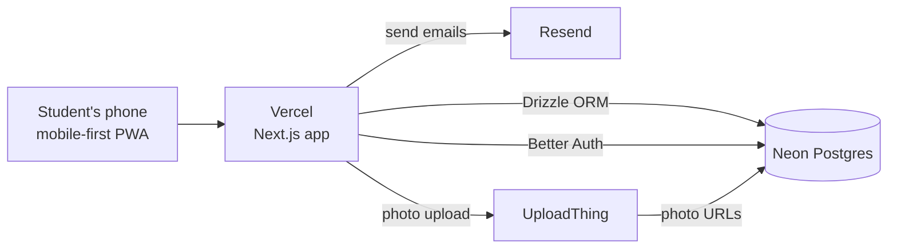

# BookLoop — Technology Stack

**Phase:** Prototype (single-school pilot)
**Monthly cost at pilot scale:** ₹0 — every service below has a free tier that covers one school.
**Last updated:** 13 Sep 2026

---

## 1. Stack at a glance

| Layer | Technology | Role |
|---|---|---|
| Framework | **Next.js 15 (App Router) + TypeScript** | Frontend + backend in one project — pages, API routes, server actions |
| Styling | **Tailwind CSS** | Utility-first styling, mobile-first |
| UI components | **shadcn/ui** (single UI system) | Forms, dialogs, dropdowns, cards, toasts — copy-paste components on Radix primitives |
| Icons / toasts | **lucide-react** · **sonner** | shadcn's default icon set; toast notifications |
| Database | **Neon Postgres** (serverless) | All relational data: users, listings, chats, transactions |
| ORM | **Drizzle ORM + drizzle-kit** | Typed schema & queries, migrations (`drizzle-kit push`), Drizzle Studio for data browsing |
| Auth | **Better Auth** | Email + password login, email confirmation links, sessions — users stored in our own Neon DB |
| Email | **Resend** | Delivers confirmation links and notify-me alert emails (free: 100/day) |
| File storage | **UploadThing** | Book photos (1–4 per listing) — never stored in Postgres, only URLs are |
| Forms & validation | **react-hook-form + Zod** | The listing form (conditional category fields) + same Zod schemas re-validated server-side |
| QR codes | **`qrcode`** (npm) | Generates the BookLoop ID QR on the listing-success screen |
| Hosting | **Vercel** | Zero-config Next.js deploys, free SSL, preview deployments per git branch |

---

## 2. Architecture

- **One deployable unit.** Next.js server actions / route handlers are the entire backend — no separate API server.
- **Chat = Postgres polling.** Messages live in the `messages` table; the chat screen refetches every few seconds. No WebSockets in the prototype (see §5 upgrade path).
- **Search = Postgres.** `ILIKE` on title + indexed filter columns (category, class, subject, price). Enough at one-school scale.
- **PWA.** A web manifest lets students "install" BookLoop to their home screen. No native app in the prototype.

---

## 3. Key decisions & why

| Decision | Why |
|---|---|
| **Drizzle over Prisma** | Chosen for speed: near-raw-SQL query performance and a tiny bundle → faster serverless cold starts on Vercel. Also the officially documented pairing with Neon's serverless driver. |
| **One UI system (shadcn only)** | Mixing UI libraries (MUI + shadcn + Ant…) causes inconsistent look and bloated bundles. Anything shadcn lacks → pull a single Radix primitive, not a second library. |
| **Better Auth over Clerk/Auth0** | Phase 1 needs only email + password + confirmation link. Better Auth is free, stores users in our own DB, and leaves room for the Phase 2 `verified` roster flag. |
| **Polling chat, not WebSockets** | Real-time infra is the most expensive thing to build and the least needed at 50–200 users. Polling a Postgres table is invisible-fast at this scale. |
| **Photos in UploadThing, URLs in Postgres** | Images in a database are an anti-pattern; UploadThing is the lowest-friction Next.js-native store. |
| **No animation library (D-048)** | All motion = Tailwind transitions in three timing tiers + shadcn/Radix built-ins, animating only transform/opacity (cheap on low-end Androids). framer-motion evaluated and rejected — see `UI_REFERENCE.md` §6.1. |
| **No payments in prototype** | Handover is cash / free, in person at the school pickup point (see PROBLEM_STATEMENT.md §8 — students never pay platform fees anyway). |

---

## 4. Environment variables

| Variable | Service |
|---|---|
| `DATABASE_URL` | Neon connection string |
| `BETTER_AUTH_SECRET` / `BETTER_AUTH_URL` | Better Auth |
| `RESEND_API_KEY` | Resend |
| `UPLOADTHING_TOKEN` | UploadThing |

---

## 5. Post-pilot upgrade path

The prototype is deliberately simple; each piece has a named upgrade slot when scale demands it:

| Prototype | Upgrade (when it hurts) |
|---|---|
| Chat via DB polling | Pusher / Ably (managed WebSockets, free tiers) |
| `ILIKE` search | Postgres full-text search → Meilisearch/Algolia at multi-school scale |
| UploadThing raw photos | Cloudinary (automatic compression of huge phone photos) |
| PWA | React Native / Expo app |
| Email-only signup | Phase 2: 11-digit Student ID + school-roster verification (`users.student_id`, `users.verified` — columns already in the schema) |
| Manual exchange browsing | Matching engine: inverse-pair suggestions, then multi-way chains |

---

## 6. Related docs

- `PROBLEM_STATEMENT.md` — the concept, features, phased verification, business model
- `SCREEN_FLOW.md` — the ~12 prototype screens
- `WORKFLOW.md` — UX laws, friction budgets, journey flows, dead-end map
- `UI_REFERENCE.md` — design tokens, component specs, motion standard, Home blueprint
- `DATABASE_SCHEMA.md` — full Drizzle schema + ER diagram
- `ARCHITECTURE.md` — layers, data flows, capacity math, scale seams
- `DECISIONS.md` — every decision, numbered and dated
- `docs/phases/` — the build plan: task-level phases with test-gated checkboxes
