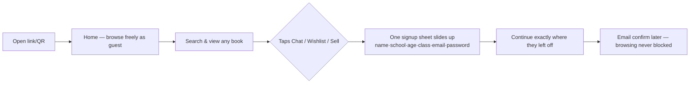
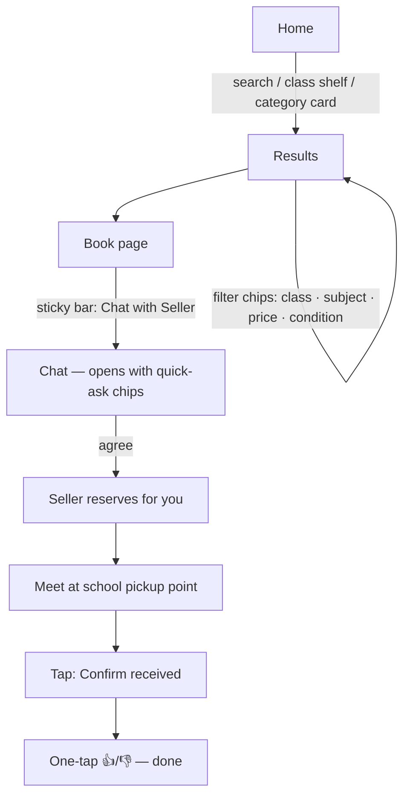
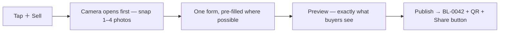
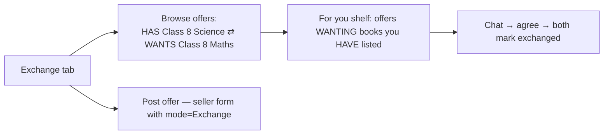

# BookLoop — User Workflows

**Goal:** every journey should feel like Amazon/Myntra — you never think about *how* to use the app, you just do the thing.
**Last updated:** 13 Sep 2026

Related docs: `SCREEN_FLOW.md` (screens) · `ARCHITECTURE.md` (how flows execute) · `DECISIONS.md` (D-041–D-044 come from this doc)

---

## 1. What "smooth like Amazon/Myntra" actually means

Big marketplaces feel effortless because of six repeatable rules, not magic. These are BookLoop's UX laws — every screen is checked against them:

| # | Rule | Amazon/Myntra version | BookLoop version |
|---|---|---|---|
| 1 | **Browse first, sign up later** | You shop without an account; login appears only at checkout | Anyone can search and view books; signup is asked only when they tap Chat / List / Wishlist |
| 2 | **Search is never more than one tap away** | Search bar pinned on every screen | Persistent search bar + bottom nav on all main screens |
| 3 | **One primary action per screen** | PDP = one big "Add to Cart" | Listing page = one sticky **Chat with Seller** bar; everything else is secondary |
| 4 | **Never a dead end** | Empty results → suggestions, "notify me" | Every empty state offers the next action (see §9) |
| 5 | **Status is always visible** | Order tracking stepper (Ordered → Shipped → Delivered) | Transaction stepper: Chatting → Reserved → Meet at pickup → Done → Rate |
| 6 | **Instant feedback** | Cart bounces, toasts confirm | Optimistic UI + toast on every action; skeleton screens, never blank loading |

**Friction budget** (hard limits we design to):

| Task | Max taps (after app open) |
|---|---|
| See books for your class | 2 |
| Open a book and start chat | 3–4 |
| List a book for sale | 1 form, under 2 minutes |
| Reply in a chat | 2 |
| Confirm a handover | 2 |

---

## 2. First-time user workflow (the make-or-break one)



- **No welcome wall.** The app opens straight into books — like Amazon, the product is the landing page. First impression = full shelves (seeded by the book drive), not a login form.
- **Signup appears at the moment of intent** and returns the user to exactly what they were doing (the listing they wanted to chat about is still open behind the sheet).
- Email confirmation is async: required before *listing or chatting is completed*, never before browsing.

---

## 3. Buyer workflow



The Myntra tricks that make this feel smooth:

- **Filter chips, not filter forms.** Active filters show as removable chips above results (`Class 9 ×` `≤₹150 ×`). One tap to remove, no "apply" buttons.
- **Class-smart defaults.** The app knows the buyer's class from their profile — Home leads with "Books for Class 9" and results default-sort to their class. Zero configuration.
- **Book page = decision page.** Photos first (swipeable), price + condition tier immediately visible, seller's 👍 count for trust, sticky **Chat with Seller** bar that never scrolls away (Amazon's buy-box rule).
- **Quick-ask chips in chat.** New chat opens with one-tap openers — `Is this available?` · `Can we meet tomorrow?` · `Will you take ₹__?` — so shy students never face a blank message box (this is how OLX/Meesho remove chat anxiety).
- **Wishlist heart** on every card and book page — one tap, no dialog, toast confirms ("Saved — we'll notify you about similar books").

---

## 4. Seller workflow — "list in under 2 minutes"

The seller form is BookLoop's checkout: every removed second adds supply. **Photo-first, smart defaults, one screen.**



Smart defaults that do the typing for the seller:

- **Class pre-filled** from the seller's profile (a Class 9 student sells Class 9 books — editable, but usually right).
- **Category-aware form**: choosing "Textbook" shows only class+subject; "Novel" shows only genre/author. Nobody sees fields that don't apply (rule 3: no noise).
- **Condition = 4 picture cards**, not a dropdown — each tier shown with an example photo and one-line description; tap one.
- **Price nudge**: shows typical range for similar sold books ("Class 9 Science books usually go for ₹80–150") — removes the "what do I ask?" freeze.
- **Sell / Exchange / Donate is one toggle** on the same form — switching to Donate just hides price; Exchange swaps price for "which book do you want?".
- **Publish screen has a Share button** (WhatsApp-ready card with photo, price and link) — sellers become the app's marketing.

---

## 5. Exchange workflow



- Offers are readable as one line: **HAS ⇄ WANTS** — no digging into detail pages to understand an offer.
- The **"For you" shelf** (offers that want what you already listed) is the prototype's lightweight version of matching — a simple query, but it *feels* like the app is working for you.

## 6. Donation workflow

- Donations appear as a **FREE shelf on Home** — visible generosity drives the loop.
- Claiming = same chat flow; first-come basis; claimed books show "Claimed" instantly and leave search.
- After a completed donation the donor gets a **badge + shareable "I gave a book a second life" card** — the feel-good receipt that makes them do it again.

---

## 7. The transaction close — order tracking, BookLoop style

The trust-critical moment is the handover. Both sides always see the same **status stepper** (Myntra order page pattern) at the top of the chat:

```
● Chatting ──── ● Reserved ──── ● Meet at pickup ──── ● Done ✓ ──── ● Rate
```

1. Seller taps **Reserve for this buyer** in chat → listing leaves search, both see "Reserved".
2. Pinned card shows the pickup point and a **"suggest a time"** quick action.
3. After handover, seller taps **Mark as Sold** → buyer gets **Confirm received** (one tap).
4. Confirmation triggers the 👍/👎 prompt for both — one tap, skippable, done.

**Zombie-reservation guard:** a reservation that sits unconfirmed for **72 hours auto-expires** — the listing quietly returns to `active` and both sides are notified ("Reservation expired — book is available again"). Checked lazily on read (no cron, per ARCHITECTURE.md); no book ever gets stuck "Reserved" because someone stopped replying — the marketplace never silts up.

---

## 8. Notifications workflow (pull, not push — but never missed)

- Bell icon with badge count in the app shell (30s poll, per ARCHITECTURE.md §3.4).
- Notification taps **deep-link to the exact place**: alert match → that listing; chat nudge → that chat; confirm request → the stepper.
- Email (best-effort) only for the two moments that matter when the app is closed: wishlist-match found, and "buyer/seller confirmed — rate now".

---

## 9. Dead-end prevention map (rule 4, enforced)

| Screen | Empty/failure state | The next action offered |
|---|---|---|
| Search results | No match | "Notify me when it's listed" (creates alert) + relaxed-filter suggestions ("8 books in Class 9 — see all") |
| Home (launch week) | Thin supply | Book-drive listings seeded pre-launch (D-011); "Be the first — list a book" card |
| Chat | Seller silent 48h | Nudge banner: "Seller inactive — 3 similar books available" → results |
| Reserved listing viewed by others | Book taken | "Reserved — see similar" + one-tap alert for that title |
| Wishlist | Empty | Shows trending books in the user's class |
| My listings | None | "Your finished books are worth money — list one" → Sell |
| Expired reservation | 72h passed | Auto-relist + both parties notified (§7) |
| Publish fails (offline) | Form data | Draft saved locally — "Resume listing" on next open; photos re-upload only if missing |

---

## 10. Workflow rules for development

1. Any new screen must pass the six rules in §1 and fit the friction budget.
2. Guest users can reach every read surface; the signup sheet interrupts only write intents, and always returns the user to where they were.
3. Every list screen ships with its empty state from §9 — an empty state is part of the feature, not a follow-up.
4. Every status change the user causes must be visible within one second (optimistic UI + toast) and reflected in the stepper.
5. New workflow decisions get a `DECISIONS.md` entry when made.
