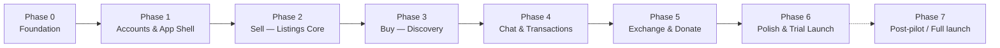

# BookLoop — Development Phases

Development is split into **7 build phases (0–6) + 1 post-pilot phase**, each in its own file. The split follows three rules:

1. **Every phase ends demoable.** At the end of each phase the app runs on Vercel and something new can be shown to a person. No phase ends with "invisible plumbing only."
2. **Supply before demand.** Selling is built before browsing polish, mirroring the launch strategy (seed listings first, then open to buyers — D-011).
3. **A phase only depends on phases before it.** Nothing is started early "while we're in there."

## Phase map

| Phase | File | Delivers | Rough effort* |
|---|---|---|---|
| 0 | [PHASE-0-FOUNDATION.md](PHASE-0-FOUNDATION.md) | Deployed skeleton: Next.js + Neon + Drizzle + shadcn, health check live on Vercel | 2–4 days |
| 1 | [PHASE-1-ACCOUNTS.md](PHASE-1-ACCOUNTS.md) | Guest app shell + signup sheet + login + email confirmation | 4–6 days |
| 2 | [PHASE-2-SELL.md](PHASE-2-SELL.md) | Full sell flow: photo-first form → published listing with BookLoop ID + QR | 5–8 days |
| 3 | [PHASE-3-BUY.md](PHASE-3-BUY.md) | Search, filters, book page, wishlist, notify-me alerts | 5–8 days |
| 4 | [PHASE-4-CHAT-TRANSACTIONS.md](PHASE-4-CHAT-TRANSACTIONS.md) | Chat, stepper, reserve → confirm → rate, 72h expiry | 6–9 days |
| 5 | [PHASE-5-EXCHANGE-DONATE.md](PHASE-5-EXCHANGE-DONATE.md) | Exchange offers + "For you" shelf, donations FREE shelf | 3–5 days |
| 6 | [PHASE-6-LAUNCH.md](PHASE-6-LAUNCH.md) | PWA, audits, seeding, launch checklist → **trial goes live** | 4–6 days |
| 7 | [PHASE-7-POST-PILOT.md](PHASE-7-POST-PILOT.md) | Verification, matching engine, dashboard, multi-school | after pilot data |

\* Part-time student-team pace. Total to trial launch: roughly **5–7 weeks**.

## Task & tick convention (applies to every phase file)

Each phase is divided into numbered tasks (`Task 2.1`, `Task 2.2`, …). Every task has:
- **Build boxes** `- [ ]` — the work itself, and
- **one 🧪 Test box** — a concrete test that must actually pass (on a phone / on production / via direct API call, as stated).

Rules:
1. Tick a box by editing the file: `- [ ]` → `- [x]`.
2. **A task is complete only when every box including its 🧪 Test is ticked.** No test pass → the task stays open, even if the code is "done."
3. Tasks are done in order within a phase unless marked otherwise.
4. Each phase ends with a **Phase gate** checklist — tick it to close the phase; the gate always includes verification on the deployed production app.

## Working rules (apply to every phase)

- **Deploy from day one.** `main` auto-deploys to Vercel; risky changes go through a preview deploy + Neon branch (D-040).
- Each phase file has a **Definition of Done** — the phase is not complete until every item passes *on the deployed app*, not just locally.
- Decisions made mid-phase go to `DECISIONS.md` at the time they're made (D-032).
- Scope discipline: anything not in the current phase's "In scope" list waits — add it to a later phase file instead of building it now.

## Source docs each phase builds from

`PROBLEM_STATEMENT.md` (what & why) · `SCREEN_FLOW.md` (screens) · `WORKFLOW.md` (UX laws & friction budgets) · `TECH.md` (stack) · `DATABASE_SCHEMA.md` (tables) · `ARCHITECTURE.md` (layers & rules) · `DECISIONS.md` (log)
